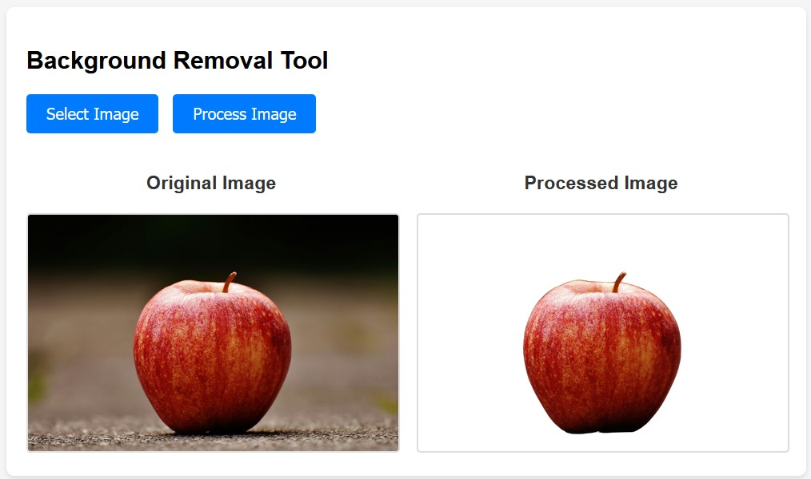

# RemoveBGDevelopment

## Development Steps for the "Remove Background" Project

The final result is accessible from [this repository](https://github.com/karrabi/RemoveBackground).

This guide can be used for a variety of projects. I will use and update it for more projects in the future.

## Development Steps

1. **Save your Python script to a .py file.**

2. **Check the script to ensure it's functional without errors:**
   - Create a virtual environment:
     ```bash
     python -m venv venv
     ```
   - Activate the virtual environment:
     ```bash
     venv\Scripts\activate
     ```
   - Install required packages:
     ```bash
     pip install -r requirements.txt
     ```
   - Run the Python script:
     ```bash
     python RemoveBG.py
     ```
   - The script will download a pre-trained model on the first run.

3. **Create a Flask API wrapper using AI:**
   - Open [Claud](https://claude.ai/).
   - Copy the content of the *Create flask API Prompt.txt* file to the chat text box.
   - Replace `[Your script here]` at the end of the prompt with the contents of `RemoveBG.py`.
   - Send the prompt to the AI and follow the instructions.
   - Create an `app.py` file and copy the script inside, then save it.
   - Run the API as mentioned in the instructions.
   - Test the API:
     ```bash
     curl -X POST -F "image=@apple.jpg" http://localhost:5000/remove-background --output result.png
     ```

4. **Create a UI interface using AI:**
   - Open [Claud](https://claude.ai/).
   - Copy the content of the *Create simple HTML prompt.txt* file to the chat text box.
   - Send the prompt to the AI and copy the generated HTML script to an `.html` file.
   - Open the HTML file in a web browser to see the result.



The final result is accessible from [this repository](https://github.com/karrabi/RemoveBackground).